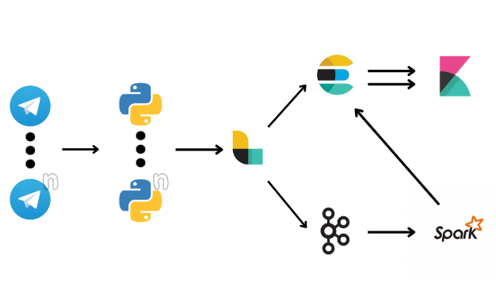
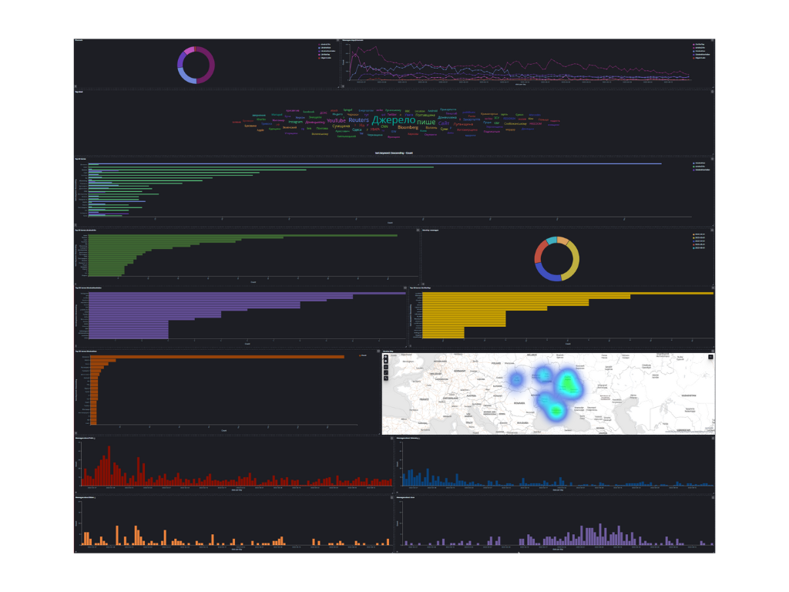

# Warplatforms - Tap for Ukraine 

<p>A multi-channel Telegram analyzer applied to the study of war dynamics between Ukraine and Russia</p>

# 🧠Data pipeline
<p align="center">
  
</p>

# 🚀 Quickstart
```shell
$ git clone https://github.com/tapunict/warplatforms.git
$ python docker-composeCreator.py
$ #> up
```

# 🔗Useful links
| Container     | URL                                             | Description                             |
| ------------- | ----------------------------------------------- | ----------------------------------------|
| Kafkaserver   | http://localhost:8080                           | Kafka UI                                |
| Elasticsearch | http://localhost:9200                           | ElasticSearch                           |
| Kibana        | http://localhost:5601                           | Kibana                                  |

# 📈 Final results
<p align="center">
  
</p>


# 👨‍💻Authors
* [Lorenzo Modica](https://github.com/loremod)
* [Giuseppe Napoli](https://github.com/Kederf-8) 